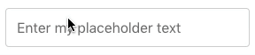

# Realtime Vue UI Library

This is the collected library of Vue UI library. The purpose is to help create realtime oriented UI library.

## Components

### Textinput Component

This component will create an text input, that will add a changed class when the values has changed. When the user presses the enter key, it will remove the changed class and set the input out of focus.

### Selectinput Componenet

This is a work in progress custom select input component.